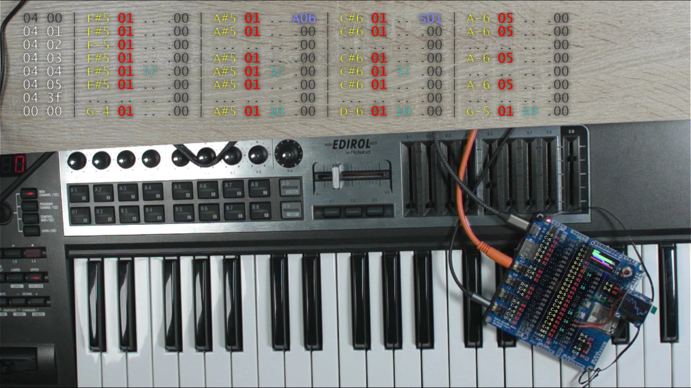

<h1 align="center">ml_mod_tracker</h1>
<h3 align="center">Arduino mod tracker</h3>  
<p align="center"> 
  <br>
  <a href="https://youtu.be/udmTQEqqInM">link to the video (1/2)</a>
  <a href="https://youtu.be/dY4aZUM-UoM">link to the video (2/2)</a>
</p>

This is a little experiment to playback mod files (may be known as Amiga Tracker or similar).
Different platforms are supported <a href="doc/board_info.md">link to the compile info</a>

# MOD tracker
This is the main module of this project.
-> <a href="https://github.com/marcel-licence/ML_SynthTools/blob/main/extras/ml_mod_tracker.md">more details</a>

# Button control
You can connect some simple push buttons between GND and a specified IO pin to control some functions of the tracker.
Some defines like the following are used on the different platforms:

```
#define BUTTON_STARTSTOP_PIN    12
#define BUTTON_NEXT_PIN 13
#define BUTTON_RESTART_PIN  14
#define BUTTON_STEP_PIN  15
```

The button module 'control_button.ino' tries to setup internal pullups on these pins if possible.
In that case the push of the button can be easily detected

# Get the project running

You will need some MOD files (please refer to the MOD module for updates of supported variants).
In the first release only 4ch MOD files are supported. 
Depending on the platform the maximum file size is limited due to the limited amount of RAM.
You will get some error messages in case the file cannot be loaded.
MOD files should be placed in the 'data' subfolder.
After compiling and uploading you need to run the littleFS upload tool for your platform.
When restarting the littleFS should be parsed by this project and one MOD file after another will be played back.

# Audio Output

I am using different output methods. The best quality can be achieved with an external audio codec.
It is possible to connect piezo speakers or go via line in of a speaker system.
Please refer to the audio module for <a href="https://github.com/marcel-licence/ML_SynthTools/blob/main/extras/audio_module.md">more details</a>
